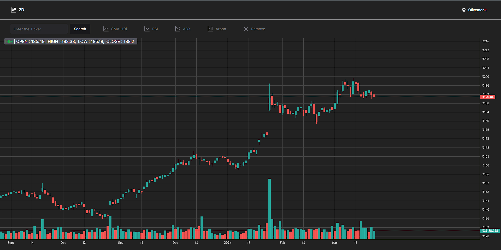
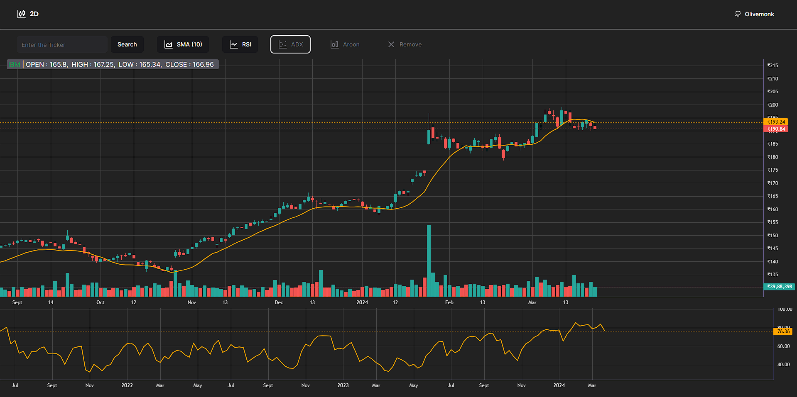

# Project Name: 2d

[Deployed Link](https://2d-stock-charts.vercel.app/)




## Overview
This project is a web application that utilizes the AlphaVantage API for fetching stock data and Lightweight Charts for displaying it. It implements various indicators such as SMA (Simple Moving Average), RSI (Relative Strength Index), ADX (Average Directional Index), and Aroon. Additionally, it features a search functionality where users can input a ticker symbol to view candlestick graphs with the aforementioned indicators. Furthermore, a volume bar chart is included below the candlestick graph, utilizing data from AlphaVantage and Lightweight Charts.

## Dependencies
- [shadcn](https://ui.shadcn.com/)- component library
- [lightweight-charts](https://www.npmjs.com/package/lightweight-charts) - for creating charts and graphs
- [lucide-react](https://www.npmjs.com/package/lucide-react) icons library
- [AlphaVantage API](https://www.alphavantage.co/documentation/#symbolsearch) Stock market data API with real time data.

## Features

1. **AlphaVantage API Integration**: Utilizes the AlphaVantage API to fetch stock data, ensuring real-time and accurate information for analysis.

2. **Candlestick Graphs**: Displays candlestick graphs for the selected stock, offering a visual representation of price movements over time.

3. **Indicator Implementation**:
    - **SMA (Simple Moving Average)**: Helps to smooth out price data by creating a constantly updated average price.
    - **RSI (Relative Strength Index)**: Measures the speed and change of price movements, indicating whether a stock is overbought or oversold.
    - **ADX (Average Directional Index)**: Indicates the strength of a trend, helping traders identify whether a trend is strong or weak.
    - **Aroon**: Helps traders identify trends and potential reversals in the market.

4. **Search Functionality**: Allows users to search for a specific stock by entering its ticker symbol, providing convenience and ease of access to desired data.

5. **Volume Bar Chart**: Presents the volume of trading activity for the selected stock, aiding in understanding the level of market participation and confirming price trends.

6. **Interactive User Interface**: Offers an intuitive and user-friendly interface for navigating through different stocks, indicators, and time frames, enhancing the overall user experience.

7. **Customization Options**: Provides options for customization such as adjusting chart settings, selecting time intervals, and toggling between different indicators, catering to the diverse needs and preferences of users.

These features collectively empower users with valuable insights and tools for informed decision-making in the dynamic world of stock trading and investment.


## Usage(try out locally)
Clone the Repository and cd into thr folder
```bash
git clone https://github.com/olivemonk/2d-stock-charts.git
cd 2d
```
Install Dependencies:
```bash
npm install
```
To run the project in development mode:
```bash
npm run dev
```

Access the Application on : [http://localhost:3000](http://localhost:3000)